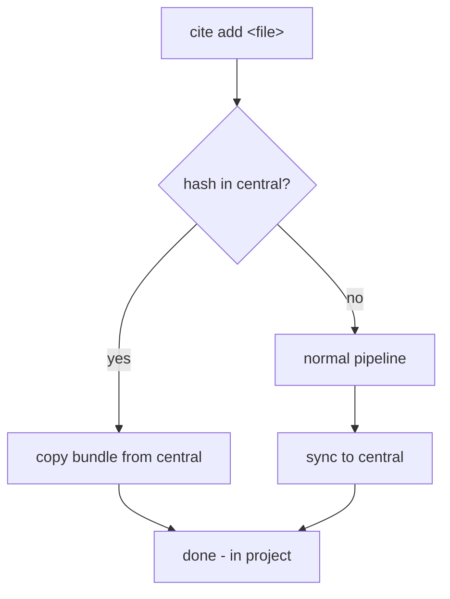

# Central Library

## Summary

A first-class central library at `~/.cite/` that auto-creates on first use, auto-receives every reference added anywhere, and accelerates cross-project reuse. `cite add` checks central before running its pipeline, `cite pull` copies references from central into a project, and `cite update` syncs metadata changes back to central.

---

## Problem Frame

When the same citation is needed across multiple projects, the full add pipeline (search, validate, hash, rename, optionally extract) must be re-run for each project. The file is re-hashed, the DOI re-fetched, the record re-validated — identical work producing identical results. Projects must be self-contained for portability (sharing, version control), so pointing them all at one shared library is not viable. The cost is wasted time and divergent copies when metadata corrections happen in one project but not another.

---

## Key Decisions

**Hardcoded `~/.cite/` path.** The central library lives at a fixed, well-known location. No configuration needed. This is a single-user tool; configurability here adds indirection without matching benefit.

**Auto-create on first add.** The central library (including its `cite.toml`) is created silently on the first `cite add` to any library. This breaks the "init is deliberate" principle — intentionally, because the central library is an invisible accelerator, not a user-managed store. The user never needs to think about it.

**Every add syncs to central.** Central is always the superset of all project libraries. No opt-out, no flag — the sync is part of the add contract.

**Update propagates; remove does not.** `cite update` syncs metadata to central (so a later `cite pull` delivers corrected metadata). `cite remove` in a project is project-local — central is the accumulated record of everything ever added.

**Independent copies after pull.** A pulled reference is a full bundle copy. No symlinks, no back-references, no ongoing link between the project copy and the central copy. The project stays self-contained and portable.

---

## Key Flows

- F1. Add with central acceleration
  - **Trigger:** `cite add <file>` in a project library.
  - **Steps:** Hash the file. Check central for matching content hash. If found, copy the bundle from central to the project library — skip search/validate/extract. If not found, run the normal add pipeline, then copy the committed bundle to central.

- F2. Pull from central
  - **Trigger:** `cite pull <id>` in a project library.
  - **Steps:** Resolve the id in the central library. Check the project library for a content-hash collision. If none, copy the full bundle (record + document + markdown + artifacts) into the project library.

- F3. Update with central sync
  - **Trigger:** `cite update <id>` in a project library.
  - **Steps:** Apply the update to the project record (existing behaviour). Find the central copy by content hash. Apply the same metadata changes to the central record. Rename the central bundle if the id changed.

---

## Requirements

**Central library**

- R1. A central library at `~/.cite/` stores every reference the user has ever added across all projects.
- R2. The central library auto-creates (with `cite.toml`) on the first successful `cite add` to any library, with no explicit init required.
- R3. The central library follows the same bundle layout and conventions as project libraries.

**Auto-sync on add**

- R4. Every successful `cite add` (by DOI, CSL, manual, or URL) copies the committed bundle to central after committing to the project library.
- R5. If the central library already contains a reference with the same content hash, the sync is idempotent — it overwrites with the latest metadata.

**Smart add (central-aware dedup)**

- R6. `cite add` in a project library checks the central library for a matching content hash before running the search/validate pipeline.
- R7. If a central match exists, the bundle is copied from central to the project library — search, validate, and extract are skipped. The result envelope indicates the reference was imported from central.
- R8. If no central match exists, the normal add pipeline runs and the result syncs to central per R4.

**Pull**

- R9. `cite pull <id>` copies a reference bundle from the central library into the current project library.
- R10. Pull copies the full bundle: record, document file, extracted markdown, and image artifacts. The project copy is independent.
- R11. Pull returns `not_found` if the id doesn't exist centrally, and `duplicate` if the same content hash already exists in the project library.

**Update sync**

- R12. `cite update` in a project library applies the same metadata changes to the central library's copy, found by content hash.
- R13. If the metadata update changes an id-bearing field, the central bundle is renamed to match the new id.

**Browse central**

- R14. `cite list --central` lists references in the central library using the same compact summary format as `cite list`.

**Remove isolation**

- R15. `cite remove` in a project library does not affect the central library. Central removal, if needed, requires `cite remove --central <id>` or operating directly on `~/.cite/`.

---

## Acceptance Examples

- AE1. Smart add finds central match
  - **Covers R6, R7.** Given `report.pdf` with content hash H exists in central as `2024-smith-etal-blackleg_abc123`. When `cite add report.pdf --doi 10.xxx` runs in a project. Then the bundle is copied from central to the project; search is not called; the envelope reports the reference was imported from central.

- AE2. Smart add with no central match
  - **Covers R6, R8, R4.** Given `report.pdf` with content hash H is not in central. When `cite add report.pdf --doi 10.xxx` runs in a project. Then the normal pipeline runs; the bundle is committed to the project and copied to central.

- AE3. First add creates central
  - **Covers R2, R4.** Given `~/.cite/` does not exist. When `cite add report.pdf --doi 10.xxx` succeeds in a project. Then `~/.cite/` is created with `cite.toml`, and the bundle is copied there.

- AE4. Pull into project
  - **Covers R9, R10, R11.** Given `cite:2024-smith-etal-blackleg_abc123` exists in central but not in the project. When `cite pull 2024-smith-etal-blackleg_abc123`. Then the full bundle is copied to the project; `status: pulled`.

- AE5. Update syncs to central
  - **Covers R12, R13.** Given a reference exists in both project and central with the same content hash. When `cite update <id> --field title="Corrected Title"` runs in the project. Then the project bundle is updated and renamed; the central bundle is updated and renamed to match.

- AE6. Remove is project-local
  - **Covers R15.** Given a reference exists in both project and central. When `cite remove <id>` runs in the project. Then the project bundle is deleted; the central bundle is unchanged.

- AE7. Degenerate case — central is the project library
  - **Covers R4, R6.** Given `$CITE_LIBRARY` is set to `~/.cite/`. When `cite add report.pdf --doi 10.xxx` runs. Then the add targets central directly; the sync-to-central step is a no-op (same library).

---

## Scope Boundaries

- Bibliography subsets and per-publication export selection are deferred as a separate feature.
- No configurable central path — `~/.cite/` is hardcoded.
- No bidirectional live sync — project copies are independent after pull; only explicit `cite update` propagates metadata back to central.
- No team-shared or network library support.
- Tags or categories on citations are out of scope.
