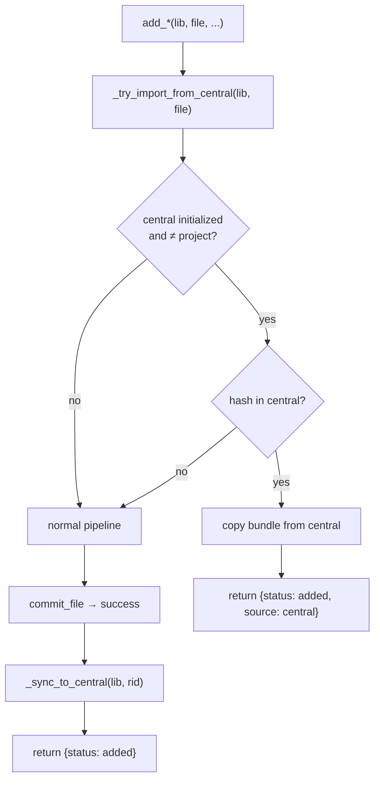

# feat: Add central library for cross-project reuse

## Summary

Add a central library at `~/.cite/` that auto-creates on first use, auto-receives every reference added anywhere, and accelerates cross-project reuse via content-hash matching. Hook smart-add and auto-sync into the existing `commit_file` pipeline so all four add paths inherit the behaviour. Add `cite pull` for explicit import, update-sync for metadata propagation, and `--central` flags for browse/remove.

---

## Problem Frame

When the same citation is needed across multiple projects, the full add pipeline (search, validate, hash, rename, optionally extract) is re-run identically each time. Projects must be self-contained for portability, so pointing them all at one shared library is not viable. The central library solves this as an invisible accelerator — bundles are copied, not shared. (See origin: `docs/brainstorms/2026-06-24-central-library-requirements.md`)

---

## Requirements

**Central library**

- R1. Central library at `~/.cite/` stores every reference ever added across all projects.
- R2. Auto-creates (with `cite.toml`) on the first successful `cite add` to any library.
- R3. Same bundle layout and conventions as project libraries.

**Auto-sync on add**

- R4. Every successful `cite add` (DOI, CSL, manual, URL) copies the committed bundle to central.
- R5. Idempotent — overwrites with latest metadata if hash matches.

**Smart add**

- R6. Check central for matching content hash before running the search/validate pipeline.
- R7. If central match, copy bundle to project — skip search/validate/extract. Envelope indicates `source: "central"`.
- R8. If no match, normal pipeline runs and syncs to central per R4.

**Pull**

- R9. `cite pull <id>` copies a reference bundle from central to the current project library.
- R10. Full bundle copy (record + document + markdown + artifacts). Independent after copy.
- R11. Returns `not_found` if absent centrally, `duplicate` if content hash already in project.

**Update sync**

- R12. `cite update` syncs metadata changes to the central copy, found by content hash.
- R13. Central bundle renamed if the metadata update changes an id-bearing field.

**Browse/remove**

- R14. `cite list --central` lists the central library.
- R15. `cite remove` is project-local. Central removal requires `cite remove --central <id>`.

---

## Key Technical Decisions

**Central path is `Path.home() / ".cite"` (hardcoded):** No env var, no config. Single-user tool — configurability would add indirection without benefit. A `CENTRAL_PATH` constant in `ops.py` and `resolve_central()` returning `Library(CENTRAL_PATH)` keeps the surface minimal.

**Auto-sync lives inside `commit_file`:** All four add paths funnel through `commit_file` in `ops.py`. Placing the sync call there means every add path inherits it with zero per-path wiring. The sync calls `ensure_central()` (auto-creates if needed) then copies the committed bundle.

**Smart-add check sits before the pipeline, at each `add_*` entry point:** The check must happen before the record is resolved (before search/validate), so it cannot live inside `commit_file`. Each `add_by_doi`, `add_from_csl`, `add_manual`, `add_url` calls `_try_import_from_central(lib, file)` first, returning early on a hit.

**Bundle copy is atomic directory copy:** `shutil.copytree` with clean removal of any existing target. The per-entity bundle layout (each reference = a self-contained directory) makes this a complete transfer with no relational integrity to maintain.

**Degenerate case via path comparison:** When `lib.root.resolve() == central.root.resolve()`, sync and smart-add are no-ops. Naturally handles `$CITE_LIBRARY=~/.cite/`.

**Update sync by content hash, not record id:** Metadata edits can change the id (derived from title/author/year), but the content hash (`_provenance.file_hash`) is invariant. A new `Library.find_id_by_hash()` locates the central bundle; the sync replaces it with the updated project bundle.

---

## High-Level Technical Design

The central library integrates into the existing architecture with no new layers. `ops.py` gains three internal helpers and one new public operation (`pull`). `store.py` gains two methods on `Library`. CLI and MCP remain thin shells.

---

## Scope Boundaries

- Bibliography subsets and per-publication export are deferred (see origin).
- No configurable central path.
- No bidirectional live sync — copies are independent after pull; only `cite update` propagates back.
- No team-shared or network library support.

### Deferred to Follow-Up Work

- MCP `instructions` text update (mentioning central/pull) — low priority, agents discover tools via the tool list.
- `cite guide --json` contract update to describe pull and central behaviour.
- `AGENTS.md` update with pull workflow guidance.

---

## Implementation Units

### U1. Store primitives — bundle copy and hash-to-id lookup

**Goal:** Add storage-layer operations for cross-library bundle transfer.

**Requirements:** R3, R5, R10

**Dependencies:** None

**Files:**
- `src/cite/store.py` (modify)
- `tests/test_store.py` (modify)

**Approach:**
- `Library.copy_bundle_to(self, record_id, target)` — removes target entry_dir if exists, `shutil.copytree(src, dst)`, returns destination path. Raises `FileNotFoundError` if source bundle missing. The bundle is self-contained, so directory copy is a complete transfer.
- `Library.find_id_by_hash(self, file_hash)` — iterates bundle dirs (same scan as `find_by_hash`), returns `record_id` (dir name) for first hash match, or `None`. Complements `find_by_hash` which returns the record dict.

**Patterns to follow:** `store_file` and `find_by_hash` in `src/cite/store.py`.

**Test scenarios:**
1. `copy_bundle_to` copies record JSON + document + markdown + artifacts directory
2. `copy_bundle_to` overwrites existing target bundle (clean replace, not merge)
3. `copy_bundle_to` raises `FileNotFoundError` for missing source
4. `find_id_by_hash` returns correct id for matching hash
5. `find_id_by_hash` returns `None` when no match exists

---

### U2. Central library resolution and auto-create

**Goal:** Add ops-layer helpers to resolve and bootstrap the central library.

**Requirements:** R1, R2

**Dependencies:** U1

**Files:**
- `src/cite/ops.py` (modify)

**Approach:**
- `CENTRAL_PATH = Path.home() / ".cite"` constant
- `resolve_central() -> Library` — returns `Library(CENTRAL_PATH)` unconditionally
- `ensure_central() -> Library` — calls `resolve_central()`, then `lib.init()` if not initialized, returns the library
- These are internal helpers consumed by U3–U6, not public CLI commands

**Patterns to follow:** `resolve_library` in `src/cite/ops.py`.

**Test scenarios:**
1. `resolve_central()` returns `Library` at `~/.cite/`
2. `ensure_central()` creates `cite.toml` when `~/.cite/` doesn't exist
3. `ensure_central()` is idempotent when already initialized

**Verification:** Unit tests pass; `ensure_central()` creates a valid library that `is_initialized()` returns `True` for.

---

### U3. Smart add and auto-sync on add

**Goal:** Make `cite add` check central before pipeline (smart add) and sync to central after commit (auto-sync). This is the core feature — every add becomes central-aware.

**Requirements:** R4, R5, R6, R7, R8

**Dependencies:** U1, U2

**Files:**
- `src/cite/ops.py` (modify — `add_by_doi`, `add_from_csl`, `add_manual`, `add_url`, `commit_file`)
- `tests/test_cli.py` (modify)

**Approach:**

Smart add — `_try_import_from_central(lib: Library, file: Path) -> dict | None`:
- Returns `None` if central not initialized, or central == project (path comparison), or file hash not in central
- If hash found: derives `record_id` from central record's `_provenance.new_filename`, calls `central.copy_bundle_to(rid, lib)`, returns an "added" envelope with `source: "central"`
- Each `add_by_doi`, `add_from_csl`, `add_manual` calls this as first action, returns early on hit
- `add_url` calls it after the fetch (before `commit_file`) for the HTML path; for the PDF download path the check happens at the eventual `add_*` call

Auto-sync — `_sync_to_central(lib: Library, record_id: str) -> None`:
- Called at the end of `commit_file`, after the project bundle is committed (after adopted-staged-extraction, before the return)
- Calls `ensure_central()`, then `lib.copy_bundle_to(record_id, central)`
- No-op if `central.root.resolve() == lib.root.resolve()`

**Patterns to follow:** Early-return gate pattern used by `commit_file`'s existing dedup checks.

**Test scenarios:**
1. Covers AE1: add file that exists in central → bundle imported from central, search not called, envelope has `source: "central"`
2. Covers AE2: add file not in central → normal pipeline runs, bundle appears in central after
3. Covers AE3: first add when `~/.cite/` doesn't exist → `~/.cite/` created with `cite.toml`, bundle synced
4. Covers AE7: `$CITE_LIBRARY` set to `~/.cite/` → add targets central directly, sync is no-op
5. `add_url` (HTML path) syncs to central
6. Existing duplicate/near_duplicate gates still fire correctly (smart add only triggers on central miss + project miss)

**Verification:** Tests cover all four add paths; central library contains the bundle after add; smart-add skips search when central has the hash.

---

### U4. Pull from central

**Goal:** New `cite pull` command to copy a reference from central into the current project library.

**Requirements:** R9, R10, R11

**Dependencies:** U1, U2

**Files:**
- `src/cite/ops.py` (modify — add `pull`)
- `src/cite/cli.py` (modify — add `pull` command)
- `src/cite/mcp.py` (modify — add `pull` tool)
- `tests/test_cli.py` (modify)

**Approach:**
- `ops.pull(lib, id)`: resolve central → check initialized → read record by id from central → check project for hash collision (→ `duplicate`) → `central.copy_bundle_to(stem, lib)` → return `{"status": "pulled", ...}`
- CLI: `cite pull <id> --library <path>` — standard command with `_require_initialized(lib)` gate
- MCP: `pull(id: str, library: str | None = None)` — same envelope wrapping as other tools

**Patterns to follow:** `ops.get` for id resolution; `ops.remove` for envelope structure; CLI `get`/`remove` commands for argument pattern.

**Test scenarios:**
1. Covers AE4: pull existing central reference → full bundle copied to project, `status: "pulled"`
2. Pull non-existent id → `status: "not_found"`
3. Pull reference already in project (same content hash) → `status: "duplicate"`
4. Pull when central not initialized → clear error message
5. Pull accepts both namespaced (`cite:...`) and bare stem ids

**Verification:** The pulled bundle in the project library is a complete, independent copy (record + document + optional markdown/artifacts).

---

### U5. Update sync to central

**Goal:** Propagate metadata changes from project to central on `cite update`.

**Requirements:** R12, R13

**Dependencies:** U1, U2

**Files:**
- `src/cite/ops.py` (modify — `update` function)
- `tests/test_cli.py` (modify)

**Approach:**
- After the project update succeeds (existing logic runs first), add a sync step:
  - Resolve central, bail if not initialized or same library
  - `central.find_id_by_hash(file_hash)` to locate the central bundle
  - If found: remove old central bundle, `lib.copy_bundle_to(new_stem, central)` — the project bundle is already correct, so a fresh copy is simplest
  - If not found: no-op (reference was never in central — possible if it was added before central existed)
- The "remove old + copy new" strategy handles the rename case (old id → new id) naturally: the old central bundle is removed regardless of whether the id changed

**Patterns to follow:** The `rename_bundle` logic in `ops.update` for how id changes are detected.

**Test scenarios:**
1. Covers AE5: update title in project → central record updated and bundle renamed to match
2. Update non-id-bearing field (e.g., publisher) → central record updated, same id
3. Update when reference not in central → silent no-op
4. Update when central not initialized → silent no-op

**Verification:** After a project update that renames the id, the central bundle has the new id and the updated record.

---

### U6. Browse and remove central

**Goal:** Add `--central` flag to `cite list` and `cite remove` for operating on the central library directly.

**Requirements:** R14, R15

**Dependencies:** U2

**Files:**
- `src/cite/ops.py` (modify — add `list_central`, `remove_central` or parameterize existing)
- `src/cite/cli.py` (modify — add `--central` flag to `list` and `remove`)
- `src/cite/mcp.py` (modify — add `central` parameter to `list` and `remove`)
- `tests/test_cli.py` (modify)

**Approach:**
- `cite list --central`: resolve central library via `resolve_central()`, call existing `library_view` on it. Mutually exclusive with `--library` (if both given, error).
- `cite remove --central <id>`: resolve central library, call existing `ops.remove` on it. Standard confirm-nothing pattern (remove is already all-or-nothing).
- MCP: add `central: bool = False` parameter to `list_refs` and `remove` tools. When true, resolve central instead of project.
- No changes to `ops.library_view` or `ops.remove` themselves — they already operate on any `Library` instance.

**Patterns to follow:** Existing `--library` flag pattern in CLI commands.

**Test scenarios:**
1. Covers AE6: `cite remove <id>` in project → project bundle deleted, central unchanged
2. `cite list --central` shows references in central library
3. `cite remove --central <id>` removes from central only, project unaffected
4. `cite list --central` when central not initialized → empty list or clear error

**Verification:** `list --central` and `remove --central` operate on `~/.cite/` exclusively, leaving the project library untouched.

---

## Acceptance Examples

Carried from origin (see `docs/brainstorms/2026-06-24-central-library-requirements.md`): AE1–AE7 cover smart add (central hit/miss), first-add auto-create, pull, update sync, remove isolation, and the degenerate case. U3–U6 map to these directly.

---

## Sources & Research

- `src/cite/ops.py:192-296` — `commit_file` pipeline: the shared back-half of all add paths. Auto-sync inserts at the end; smart-add check wraps around the callers.
- `src/cite/store.py:30-165` — `Library` class: bundle layout, `find_by_hash`, `store_file`, `rename_bundle`. New methods follow these patterns.
- `src/cite/ops.py:68-74` — `resolve_library`: the existing resolution chain (`--library` / `$CITE_LIBRARY` / `./library`). `resolve_central` is a parallel, simpler resolver.
- `src/cite/naming.py:43-49` — `content_hash`: SHA-256 of file bytes, the invariant cross-library identity.
- `tests/test_cli.py` — integration test patterns: `_run()` helper, `_new_lib()` fixture, `_sample_file()` factory. New tests follow this shape.
